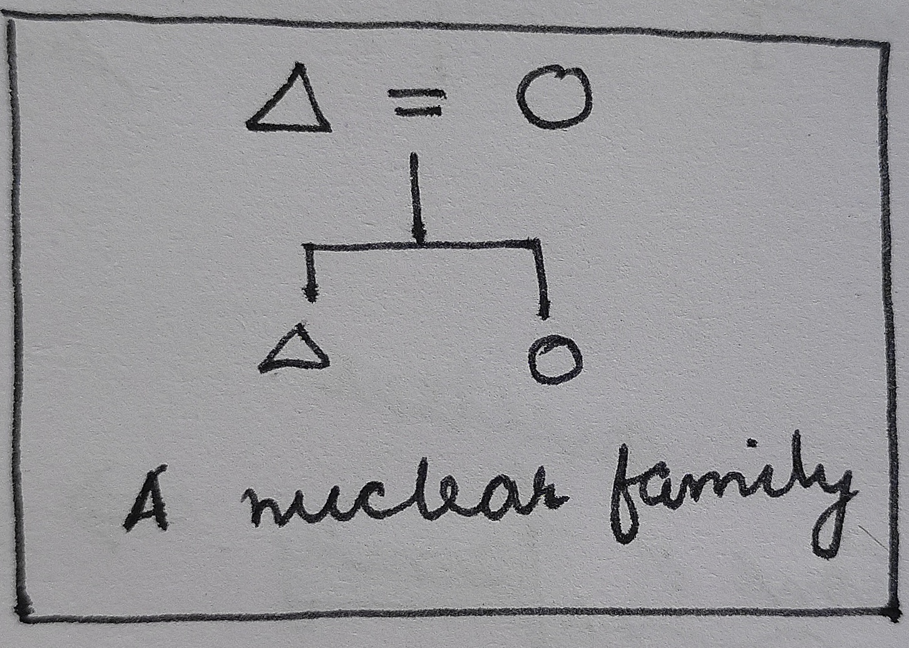
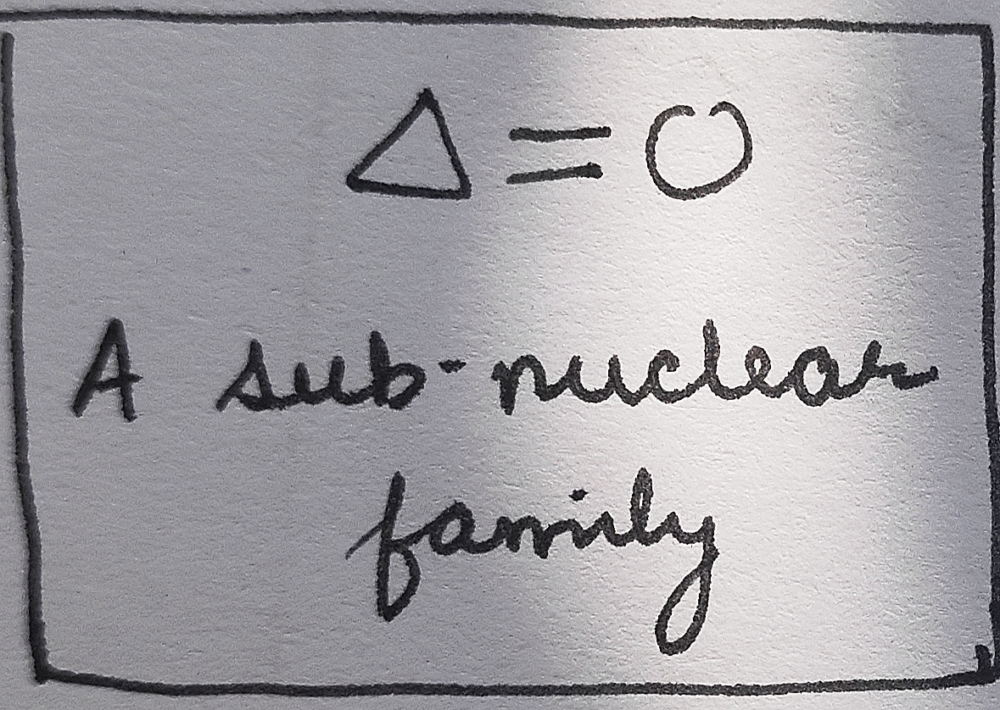
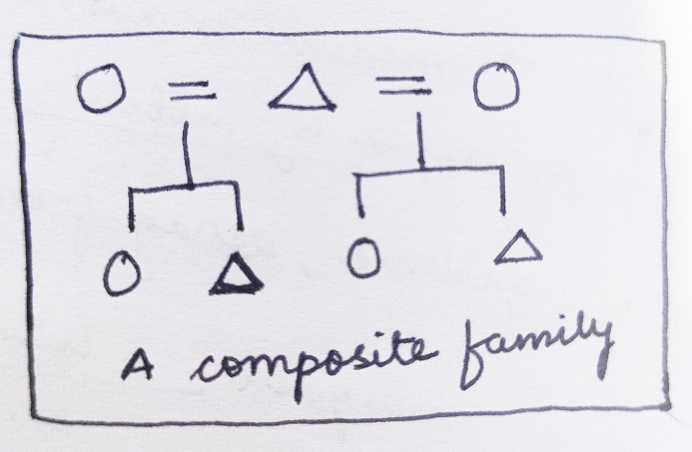

# Family

## Definition and Universality

## Basic strucutre of the Human Family

- What is the difference between a mating relationship and conjugal relationship?
  - Mating relationship is just sexual relationship
  - Conjugal relationship is institutionalized mating relationship established by Family. 

> Without conjugal relationship, there cannot be an establishment of a family. 

## Family, household and domestic groups; 

## Functions of family; 

## Types of family 
> (from the perspectives of structure, blood relation, marriage, residence and succession)
- Nuclear Family
   - Sub-Nuclear Family
   - Composite Family
- Extended Family

### Nuclear Family

- organised around Conjugal tie between husband and wife. 
- consists of husband, wife and children 
- Murdock 1949 -> nuclear family is universal social institution 
   - **disputed** based on the examples of Nayars and Israeli Kibbutz where one spouse is completely missing. 
- ideal for societies with high degree of mobility
   - hunter gatherer societies 
     - most adapted for it
     - more than 3/4 of the HG Societies have nuclear families. 
     - though the nuclear families not really that independent as they camp near the kin. 
   - modern industrial societies 
- ideal in very small percentage of societies (<5%)
- ideally has its own residence -> away from the parents
- since separate domestic and economic unit --> marginal interference by kins/relative. 
- some ideals about different roles to be played, exist:
   - economic support
   - sexual activity 
   - child care 
- however, the roles aren't rigid 

#### Dissolution of nuclear family
- doesn't affect larger kin, affects only the nuclear unit. 
- Reasons? 
   - Due to divorce - failure to carry out the familial roles 
  - Due to death of a spouse. 

#### Various functions in a nuclear family

Function  | Nuclear Family (Currently)  | General Families (Past) 
---|---|---
 Economic Activities |   Economic consumption by family |   Economic productivity  by Family group
Leisure, Recreation |  peers |   family group
Care | state sponsored schemes | family / kin
Socialisation of children | schools and such institutions | big families or kins

##### Effect of declining functions of the nuclear family
- increased expectation from family to satisfy the needs of _affection_ and _intimacy_ 
- personal happiness has become a primary cultural value.
- nuclear family is not fully capable in satisfying these growing needs

### Sub-Nuclear Family

- A family characterized by presence of only the spouses with no children. 
- doesn't fulfil the criterion of nuclear family. 

### Composite Family 

- aggregates of nuclear family linked by common spouse
- Two types
   - polygynous household
      - one man, multiple wives
      - each wife separate residence (generally)
         
   - Polyandrous household
      - one wife, multiple husbands
      - #insertDiagram
 - the dynamics of compound family is different from a normal nuclear family. 
    - children are particularly very closer to respective mothers --> strong tie
    - other relationship strength varies 
    - the interaction between the co-woves is important for analysing the dynamics if a compound family. 

### Extended Family

## Impact of urbanization, industrialization and feminist movements on family.

  

