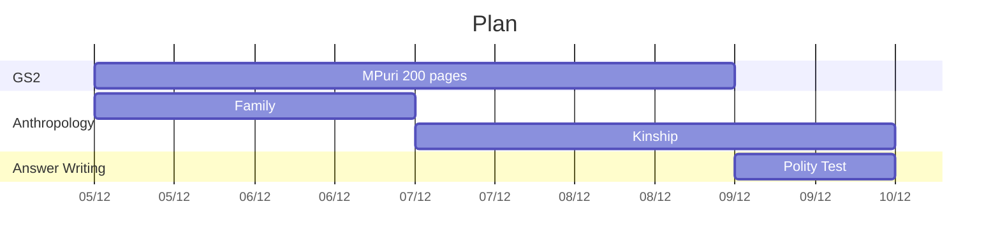

# Week 2020-50
> 2020-12-05 (**Saturday**) <- `10 days` -> 2020-12-13 (**Sunday**)

### This Week 
- Saturday - [[2020-12-05]]
- [[2020-12-06]]
- [[2020-12-07]]
- [[2020-12-08]]
- [[2020-12-09]]
- [[2020-12-10]]

